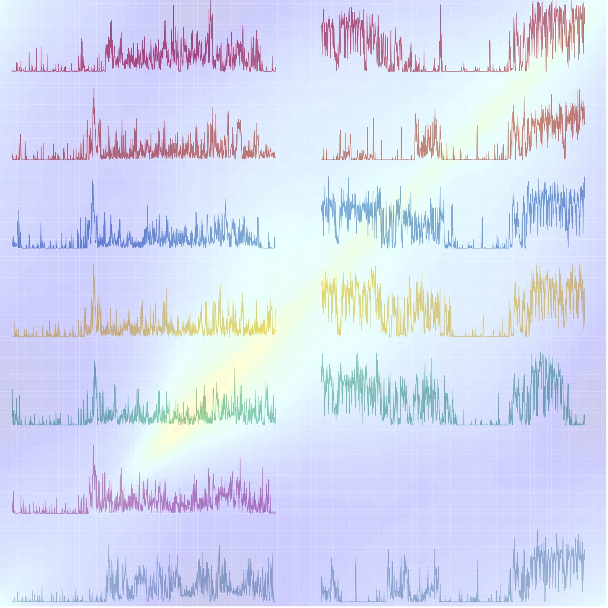

   

Modern Functional Data Analysis consists of the development of robust statistical methods and reproducible software for model implementation and visualization. The goal of this website is to provide the code and software to implement statistical methods and reproduce the analysis presented in the book "Functional Data Analysis with R" by Crainiceanu, Goldsmith, Leroux, Cui. 

In the "Datasets" section, we provide an overview of the datasets used in the book and the way to access them. 
In the "Chapters" section, we provide the code and software and show how to reproduce the analysis presented in the book.
In the "Scripts" section, we provide some scripts or functions that the code depends on that are not shown in the book.

The website will be updated from time to time as the software develops. 